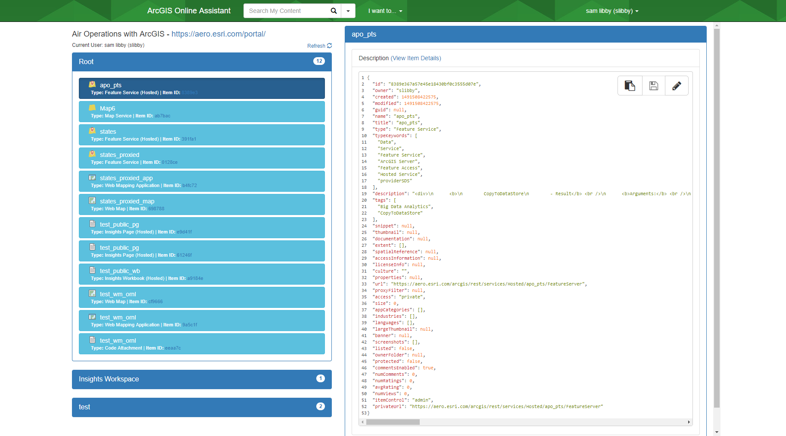

# ago-assistant

This app uses the [ArcGIS REST API](http://www.arcgis.com/apidocs/rest/) to provide several different utilities for working with content in [ArcGIS Online](http://www.arcgis.com/home/) and [Portal for ArcGIS](http://www.esri.com/software/arcgis/portal-for-arcgis).

[View it live](https://ago-assistant.esri.com)

## Features
* Copy content between Portals and Organizations
* View and edit the JSON of content
* Update the URLs of services in a web map
* Update the URL of a registered application or service
* View user stats

## Instructions

1. Fork and then clone the repo -OR- [download a recent release](https://github.com/Esri/ago-assistant/releases).
2. Run and try the samples.

#### Using Grunt
This project uses [Grunt](http://gruntjs.com/) to automate building the application for deployment on a web server. It does a handful of things for you that will make life easier when setting up this application.

  * Download and install [node.js](http://nodejs.org/).
  * Download or clone this project to your machine.
  * Go to the project folder in your terminal or command prompt and run `npm install` to install the project dependencies.
  * [Register the app in your portal](http://server.arcgis.com/en/server/latest/administer/linux/add-items.htm#ESRI_SECTION1_0D1B620254F745AE84F394289F8AF44B) to obtain an `appId` for using the OAuth dialog to log in. Be sure to add the correct redirect URI (the location where your app will be hosted).
  * Update [`config.json`](config.json) with your portal's url and new `appId`.
  * Run `grunt` from the command line to generate an optimized build of the app in the `build` folder.

## Requirements

* Notepad or your favorite HTML editor
* Web browser with access to the Internet

## Third Party Libraries Used
* [jQuery](http://jquery.com/)
* [Bootstrap](http://getbootstrap.com/)
* [jQuery-UI](http://jqueryui.com/)
* [D3](http://d3js.org/)
* [mustache.js](https://github.com/janl/mustache.js)
* [Cal-Heatmap.js](http://kamisama.github.io/cal-heatmap/)
* [NProgress.js](http://ricostacruz.com/nprogress/)
* [highlight.js](http://highlightjs.org/)

## Resources

* [ArcGIS REST API](http://www.arcgis.com/apidocs/rest/)
* [ArcGIS Online](http://www.arcgis.com/home/)
* [ArcGIS Blog](http://blogs.esri.com/esri/arcgis/)
* [twitter@esri](http://twitter.com/esri)

## Issues

Find a bug or want to request a new feature?  Please let us know by submitting an issue.

## Contributing

Anyone and everyone is welcome to contribute.

## Licensing
Copyright 2015 Esri

Licensed under the Apache License, Version 2.0 (the "License");
you may not use this file except in compliance with the License.
You may obtain a copy of the License at

   http://www.apache.org/licenses/LICENSE-2.0

Unless required by applicable law or agreed to in writing, software
distributed under the License is distributed on an "AS IS" BASIS,
WITHOUT WARRANTIES OR CONDITIONS OF ANY KIND, either express or implied.
See the License for the specific language governing permissions and
limitations under the License.

A copy of the license is available in the repository's [license.txt](license.txt) file.

